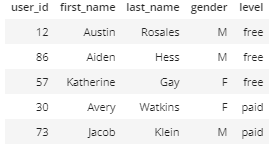
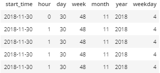
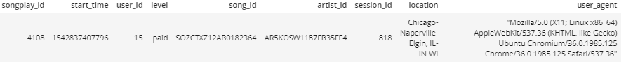

# Data Modeling with Postgres Project. 
This project is for a startup called Sparkify that has collected data they want to analyze. the main focus of this analyses is to understand what their users are listening to. The task of this project is to create a database using Postgres in order to do queries and do analysis for song played by the users. The structure of the database uses a star schema which is good for doing queries and calculation analysis. An ETL pipeline is needed in order to go through the collected data and extract the data then put it in the database. 

## Runing the Code
To run the python scripts, first start a new python command line and type:
```pytohn 
run create_tables.py
```
This would create the database and its tables.

Then open a new python command line run the etl python file to extract data:
```python
run etl.py
```

## Files
### sql_queries.py 
this file contains the a list of SQL queries to create tables, insert into tables, and drop tables.data types where selected based on the data in provided by Sparkify.
all values should be NOT NULL, but there are exeptions. Location data is not garanted from most devices, and could be change frequently.And, gender information which is not required in most sign-ups. 
#### create tables : 
create songplay table:
```sql
    CREATE TABLE IF NOT EXISTS songplays 
    (songplay_id SERIAL PRIMARY KEY, start_time NUMERIC NOT NULL, user_id VARCHAR NOT NULL, 
    level VARCHAR NOT NULL, song_id VARCHAR, artist_id VARCHAR, session_id VARCHAR NOT NULL,  
    location VARCHAR, user_agent VARCHAR NOT NULL);
```
create the users table:
```sql
    CREATE TABLE IF NOT EXISTS users 
    (user_id VARCHAR PRIMARY KEY, first_name VARCHAR NOT NULL, last_name VARCHAR NOT NULL, 
    gender VARCHAR, level VARCHAR NOT NULL)
```
create the songs table:
```sql
    CREATE TABLE IF NOT EXISTS songs 
    (song_id VARCHAR PRIMARY KEY, title VARCHAR NOT NULL, artist_id VARCHAR NOT NULL, 
    year INT, duration NUMERIC)
```
create the artists table:
```sql
    CREATE TABLE IF NOT EXISTS artists 
    (artist_id VARCHAR PRIMARY KEY, name VARCHAR NOT NULL, location VARCHAR, 
    latitude NUMERIC, longitude NUMERIC)
```
create the time table:
```sql
    CREATE TABLE IF NOT EXISTS time 
    (start_time DATE NOT NULL, hour INT, day INT, 
    week INT, month INT, year INT ,weekday int)
```
#### insert data queries:
insert into songplay table:
```sql
    INSERT INTO songplays 
    (start_time, user_id, level, song_id, artist_id, session_id,  location, user_agent) 
    VALUES (%s, %s, %s, %s, %s, %s,  %s, %s)
```
insert into users table:
```sql
    INSERT INTO users (user_id, first_name, last_name, gender, level)
    VALUES (%s, %s, %s, %s, %s)
    ON CONFLICT (user_id) DO UPDATE SET level=EXCLUDED.level
```
insert into songs table:
```sql
    INSERT INTO songs (song_id, title, artist_id, year, duration)
    VALUES (%s, %s, %s, %s, %s)
    ON CONFLICT DO NOTHING
```
insert into artists table:
```sql
    INSERT INTO artists (artist_id, name, location, latitude, longitude)
    VALUES (%s, %s, %s, %s, %s)
    ON CONFLICT (artist_id)
        DO UPDATE 
            SET location=EXCLUDED.location , latitude=EXCLUDED.latitude, longitude = EXCLUDED.longitude
```
insert into time table:
```sql
INSERT INTO time (start_time, hour, day, week, month, year ,weekday)
VALUES (%s, %s, %s, %s, %s, %s, %s)
```
#### FIND songs:
Here is the  SELECT query to to find the `song_id` and `artist_id` where `title` from song table, `name` from artist table, and `duration` from song table match input. 
```sql
SELECT s.song_id, a.artist_id
FROM songs AS s
JOIN artists As a
ON s.artist_id = a.artist_id
WHERE  s.title = %s AND a.name = %s AND s.duration = %s
GROUP BY s.song_id, a.artist_id 
```

### create_table.py
This code creates a database , then runs queries from `sql_queries.py` file to create the database tables.

### etl.py 
this is the ETL pipeline code, it does Extract information from files, Transform file data to fit data base tables, and Load data into database. 
####  Processing song_data:
extracting the data from a JSON file , is done using pandas library. it's done by inserting data into a `DataFrame` which is a 2D data structure that helps with handling the data and transforming it.   
```python
df = pd.read_json(filepath, lines=True)
```
Getting information form the `DataFrame` for the song table: 
```python
    song_df = df[['song_id', 'title', 'artist_id', 'year', 'duration']]
    song_data = song_df.values
    song_data = song_data[0]
```
Then using the insert query from `sql_queries.py` to insert data into database:
```python
    try:
        cur.execute(song_table_insert, song_data)
    except psycopg2.Error as e:
        print("Error: Inserting Rows")
        print (e)
```
Getting information form the `DataFrame` for the artist table: 
```python
  artist_df = df[['artist_id', 'artist_name', 'artist_location', 'artist_latitude', 'artist_longitude']]
  artist_data = artist_df.values
  artist_data = artist_data[0]
```
Inserting data into Database:
```python
    try:
        cur.execute(artist_table_insert, artist_data)
    except psycopg2.Error as e:
        print("Error: Inserting Rows")
        print (e)
```
#### Processing log_data:
this also starts by opening a JSON file and loading it into a `DataFrame` structure using Pandas.
```python
  df = pd.read_json(filepath, lines=True)
```
For the time table data needs to be transformed in order to fit the table structure. first timestamp are extracted from the `DataFrame`. Then converted into a `datatime` type or  `dt` that has attributes that can help extract time infomation easily as can be seen in the line where the append is happening ex: `i.week`: 
```python
    # filter by NextSong action
    df = df[(df.page == 'NextSong')]

    # convert timestamp column to datetime
    t= df[['ts']] 
    
    #convert values from string from to int
    temp_list = list(map(int, t.values)) 
    
    #convert integers to datatime for easy access, using its attributes 
    time_ToDateTime = pd.to_datetime(temp_list, unit='ms')
    
    #creating the time_data records, using the datatime list 
    #goes through each timestamp to extract needed info,then add it to time_data. 
    time_data = []
    for i in time_ToDateTime:
        time_data.append([i, i.hour, i.day, i.week, i.month, i.year, i.dayofweek ])
    
    # insert time data records
    column_labels = ('timestamp', 'hour', 'day', 'week of year', 'month', 'year', 'weekday')
    time_df = pd.concat([pd.DataFrame([i], columns= column_labels) for i in time_data], ignore_index=True)
```
Inserting time data into Database:
```python
    for i, row in time_df.iterrows():
        try: 
            cur.execute(time_table_insert, list(row))
        except psycopg2.Error as e:
            print("Error: Inserting Rows")
            print (e)
```
Getting information form the `DataFrame` for the user table: 

```python
user_df = df[['userId', 'firstName', 'lastName', 'gender', 'level']]
```
Inserting users data into Database:
```python
    for i, row in user_df.iterrows():
        cur.execute(user_table_insert, row)
```
Lastly for songplay table which requires a query as explained previously in the **FIND songs** section :
```python
    for index, row in df.iterrows():
        
        # get songid and artistid from song and artist tables
        try:
            cur.execute(song_select, (row.song, row.artist, row.length))
        except psycopg2.Error as e:
            print("Error: Selecting Rows")
            print (e)
        results = cur.fetchone()
        
        if results:
            songid, artistid = results
        else:
            songid, artistid = None, None

        # insert songplay record
        songplay_data = [row.ts ,row.userId, row.level, songid , artistid, row.sessionId, row.location, row.userAgent]
        try:
            cur.execute(songplay_table_insert, songplay_data)
        except psycopg2.Error as e:
            print("Error: Inserting Rows")
            print (e)
```

These are output of queries after runing the ETL program. 
```sql
SELECT * FROM users LIMIT 5;
```

```sql
SELECT * FROM time LIMIT 5;
```


In order to find if the SELECT query has worked as intended I tested this query:

```sql
SELECT * FROM songplays WHERE song_id IS NOT NULL
```
Which returns one row just like explained in Rubrics of the project:




    

